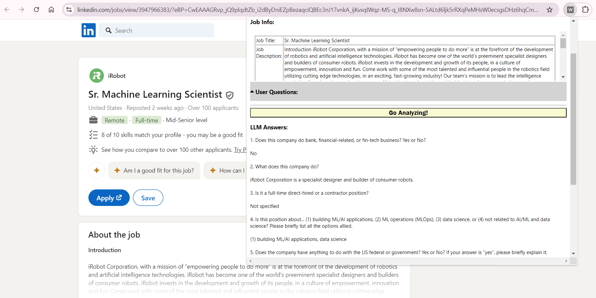

# What is this Job About

"What is this Job About" is a Google Chrome extension that helps extract critical information from job descriptions. 

See. Here is the situation of the job seekers. 
1. Job descriptions are long, but we don't have much time to read through all of them. 
2. In our mind, we have criteria for dream jobs, and we only care about the job descriptions that satisfy our criteria. 

So. Here is a Google Chrome extension to help you find out whether the one you are browsing is a dream job of you. 

### Supported Job Boards and Limitations  

Here are the currently supported job boards: 
* **LinkedIn** with URLs start with `https://www.linkedin.com/jobs/view`
* **Glassdoor** with URLs start with `https://www.glassdoor.com/job-listing/` 
* **Indeed** with URLs start with `https://www.indeed.com/viewjob?`

### Installation 

Check out this repo and install it under Google Chrome's developer mode. 

### Usage 

How to use the extension?
1. Acquire an OpenAI API Key.
2. Install the extension, and open the extension popup.  
3. Specify the OpenAI API Key and save it. 
4. Specify the "User Questions" that define your dream jobs, and save them. 
5. If the extension successfully captured the job title and description from the opened webpage, they will be displayed under the "Job Info" section. 
6. Once the job info is captured, click "Go Analyzing!". 
7. Be patient and wait for the LLM answer(s). Do not close the extension popup. 

Good luck for your job hunting! 

### Screenshot(s) 

